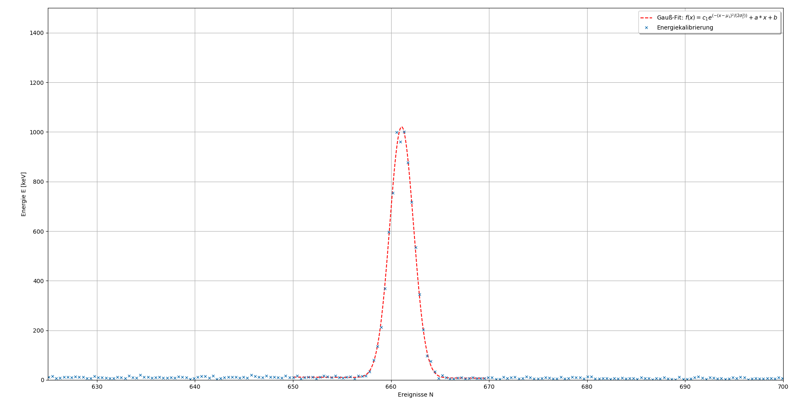

# pyplotfit  
## dependencies / used modules 
- matplotlib.pyplot   
- matplotlib.patches  
- numpy  
- math  
- scipy  
- inspect  
  
## HOW-TO
### read datas
 First of all reading your Dataset. According to our experiment, we designed a method for reading the output file of an Gamma-Ray-Detektor. Feel free to add or change other reading functions in <code> datasetfunctions.py</code>.
```python
dataset = datasetfunctions.readfile("EU152.Spe")
```
The output of <code> readfile(filename)</code>  is an dictionary.
```python
dataset = {  
	  'name': filename.split('.')[0],  
	  'time': int(measuretime),  
	  'channel': channel,  
	  'counts': counts  
}
```
### realize plot
In the next step you are able to create an <code>Plot()</code>-, <code>Scatter()</code>- or <code>Errorbar()</code>-Object. 
The only required parameters are the datas for x and y. For example:
```python
plot = plot.Errorbar(X, Y)
```
All other parameters are not required or there are default settings. In depends on the chosen plot style you are able to set ... (with default values)
```python
Plot(
	x: list (required)
	y: list (required)
	dataLabel=None: str 
	axisLabel=None: list
	xAxis=None: list
	lineType="--": str
	lineColor="blue": str 
	grid=True: bool
	extraLegendComponent=None: str
)

Scatter(
	x: list (required)
	y: list (required)
	dataLabel=None: str 
	axisLabel=None: list
	xAxis=None: list
	lineType="--": str
	lineColor="blue": str 
	grid=True: bool
	extraLegendComponent=None: str
	marker=None: str
	edgecolors=None: str
	linewidths=None: str
)

Errorbar(
	x: list (required)
	y: list (required)
	dataLabel=None: str 
	axisLabel=None: list
	xAxis=None: list
	lineType="--": str
	lineColor="blue": str 
	grid=True: bool
	extraLegendComponent=None: str
	yerr=None: list (same dimension like y required)
	xerr=None: list (same dimension like x required) 
	elinewidth=1.5: float
	markersize=5: float  
	ecolor="lightgray": str 
	fmt="x": str
)
```
### add fits

If you want, you can add fits to an specific area. Therefore you create an <code>fit()</code> object.
```python
GaussFit = fit.Fit(plot, X, Y, 3, upperLimit=670, lowerLimit=650, initialGuesses=[1000, 660, 1, 1, 1])
```
Required Arguments are the plot object, the x- and y-datas and the fit index. All avaible fits will be printed in the console with the current index.
```python
List of all key numbers of available fits:
1: doublegaussianwithlinearunderground
2: exp
3: gaussianwithlinearunderground
4: linear
```
Not required arguments are upper- and lower limits for the fit area and the initial guesses. But maybe the fit wont show if you dont set them.

# Example
```python
import src.datasetfunctions as dsf
import src.fit as fit
import src.plot as plot

if __name__ == '__main__':

    # read your file and set x and y
    dataset = dsf.readSpeFile("Sichel-Tanne.Spe")
    X, Y = dataset["channel"], dataset["counts"]

    # change scale and calculate statistical error
    X = dsf.calibrate_dataSets(X, [0.39, 18.62])
    yerr = dsf.calculatestatisticalerrors(Y)

    # create plot object
    plot = plot.Errorbar(X, Y, xAxis=[625, 700], axisLabel=["Ereignisse N", "Energie E [keV]"], ecolor="grey")
    plot.setDataLabel("Energiekalibrierung")

    # create fit object
    GaussFit = fit.Fit(plot, X, Y, 3, upperLimit=670, lowerLimit=650, initialGuesses=[1000, 660, 1, 1, 1])

    # show everything you done
    plot.showPlot()
```

Console output:
```python
Calculated fit-params:
        c1  =  1012.3287915580813 with standard deviation +/- 8.20387656143891
        mu1  =  661.0887096784303 with standard deviation +/- 0.011160440691047291
        sigma1  =  1.2134294338415335 with standard deviation +/- 0.011929200090804748
        a  =  -0.2220767579949974 with standard deviation +/- 0.3694342003581278
        b  =  155.6003162319009 with standard deviation +/- 243.63893229660619
```

